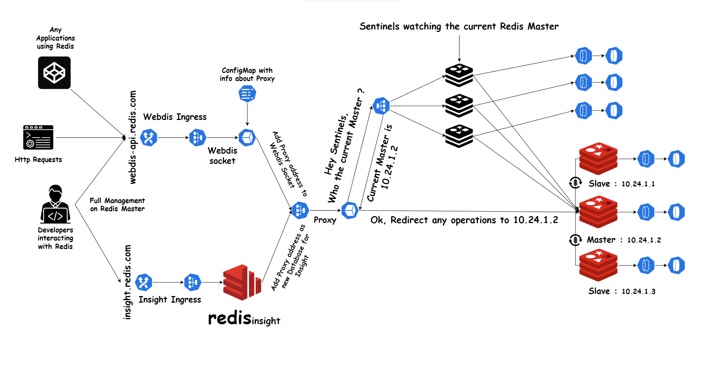
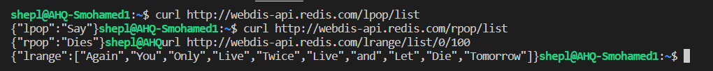
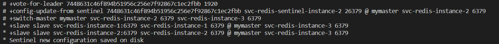
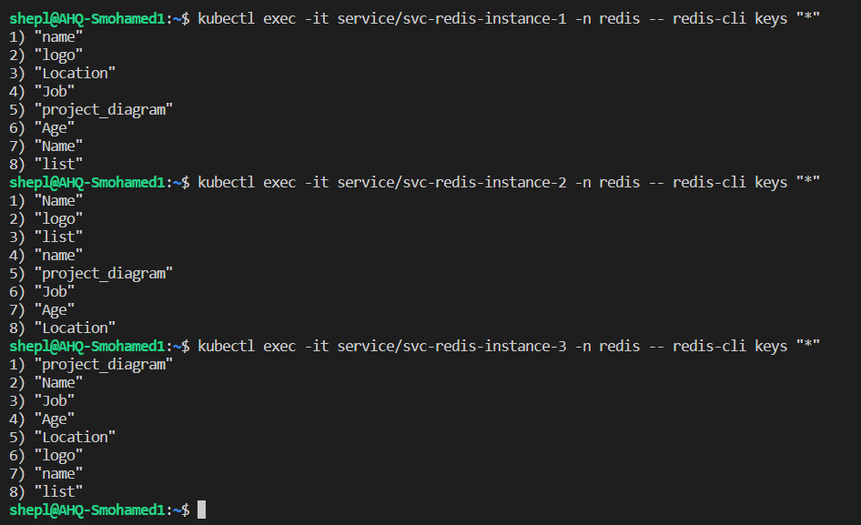

# Redis-Cluster
Introducing Redis cluster with high availability and fault tolerance in Kubernetes and how it's possible to interact with Redis securely with an HTTP server if there are applications that require a Redis database. making it easier to interact with Redis from web applications or for developers to work with it.

# Redis Cluster Configurations

- There are 3 Redis deployments:
    - `Master` - Configured as the initial master of the cluster, any Redis operations will be performed by it.
    - `2 Slaves` - Both configured as replicas for the master to achieve high availability for the cluster. so they will connect to the master by its service:port and then each one will start syncing any data will be written by the master.
- Each Redis deployment is configured with Modules: `redis_bloom` `redis_gears` `redis_timeseries` `redis_ai` `redis_search` `redis_graph` and `rejson`. these modules are useful for the developers, giving them powerful features that can be used to build complex and scalable applications.
- Each Redis deployment is configured with a persistent volume for storing the data inside it in case the pod is killed or down, once another pod has been up it can restore its last state about if it was master or slave.

# Sentinels Configurations

- Redis Sentinel is a high-availability solution for Redis. It provides automatic failover, configuration management, and monitoring for Redis clusters.
- There are 3 Sentinel deployments each one configured with:
    - `REDIS_MASTER` - redis master address
    - `SENTINEL_QUORUM` - the minimum number of Sentinels that need to agree on a master pod being considered as down before initiating failover procedures. 
    - `SENTINEL_DOWN_AFTER` - the time duration in milliseconds after which a master pod will be declared as down if no response is received from it. 
    - `SENTINEL_FAILOVER` - determines the time, also in milliseconds, that sentinel instances will wait before starting a failover procedure once the master pod is deemed unresponsive.
Each sentinel deployment is configured with a persistent volume for storing the configuration file inside it. in case the pod is killed or down, once another pod has been up it can restore its last state about the current master.
- How do Sentinels work?
    - Once the 3 Sentinels have been deployed, each one will be configured with the above configs and they will start connecting to the current master by its service.
    - The Sentinels monitor the master Redis pod by sending PING commands to it. If a Sentinel does not receive a response from the master Redis pod for 5 seconds ( as we configured the `SENTINEL_DOWN_AFTER` variable), it marks the master as down and because we configured the `SENTINEL_FAILOVER` variable, it will initiate a failover process to elect a new master Redis pod among the available replicas.
    - The Sentinels use a voting process to elect a new leader if the current master goes down. This is done by the Sentinels exchanging information and agreeing on which replica should be promoted to the new master. A Sentinel will initiate a failover if it sees that the master is down and a quorum of Sentinels (the minimum number required to make a decision, determined by the value of `SENTINEL_QUORUM`) agree that the master is down. Once a new master is elected, the other replicas are reconfigured to replicate from the new master, and the clients are redirected to the new master, allowing the system to continue operating without any downtime.

# How Proxy Works
- Proxy service will be the bridge between the client and the current Redis master. so any requests will be forwarded to the master by the proxy.
- This is the important part to ensure that any incoming operations will be only performed by the master.
- For letting the proxy work, it needs to be connected with the sentinels because they know who the current master & slaves are, so the proxy must ask each sentinel instance about the current master in case the master changed or been down then forward all the traffic to it.

# Webdis API Configurations

- It's always important to secure your connections to your database as much as possible, and for that, I tried to use a socket called Webdis developed especially for interacting with Redis to act like a proxy. there is a good case that might let you use the Webdis socket:
    - Webdis can be used to restrict access to Redis by providing authentication and authorization mechanisms, such as password protection and IP whitelisting.
    - Webdis provides a simplified REST API that can be used to interact with Redis, making it easier for developers to work with the database.
    - If you deployed the database outside the cluster and want to make it available globally between all your applications.
    - The ability to transform Redis data into different formats such as JSON, RAW, IMG, TXT, and XML, makes it easier to integrate Redis with other systems or applications.
    - And much more ...
- After the Proxy service connects to sentinels and discovers the current master, we will set a Configmap for webdis socket with the proxy service:port so any coming operations, or requests will be requested during the socket it will be forwarded to the current Redis master.

# Redis Insights Configurations

- To fully watch what's happening to your database, you will need Redis insights, it's a UI application that lets you check very important things like how many connections are active, what are the most common commands being used, how much memory is being used, all your stored database inside Redis, and much more. it's a very important tool for developers.
- In my case, I need Redis insights to watch the Redis master data and all the clients which being been connected to perform operations, and check all the data inside. so we will tie Redis insights with the proxy service to do that.

# Installation & Testing
- To make sure that we are setting up the cluster rightly and with no errors, we must deploy each component in the order like that :
    - `Redis` - to make sure that Redis is up and running first
    - `Sentinels` - to make sure that Sentinels can discover the Redis master & workers after they are deployed without errors.
    - `Proxy` - proxy must be after Redis & sentinel deployment because it listens to the sentinel's headless services to know the current master info and then connect to it. so this will make sure that the proxy can catch up with the master without errors.
    - `Webdis` or `Redis-Insights` then `Ingress`.

- If we checked the logs for any of the Redis pods, we will find that modules have been loaded

- Let's access the first pod to see if it's the current master or another pod

- Yes, the current master was the first pod, so the second, and third pods must have a slave role 

- If we checked the master pod logs, we can see that both slaves tried to ask the master for authentication & syncing the data

- From the other side, we can see that slaves able to sync the data with the current master

- Let's check if the proxy is connected with the current master too

- After making sure that the proxy is working fine, we can define it as a new database by insights

- Test connection

- So by that, we make sure that the cluster is running fine and both insights, proxy is ok.

# Webdis Socket

- Let's try to check if Webdis can interact with the current master. I will try to send `PING` to check if it will `PONG` 

- By receiving a `PONG` msg this tells that it can interact with the Redis cluster.

- To list the modules

- From insights

- To check if we connected with the current master

- From insights

- Let's test the socket against some operations, I will try to add some keys with values

- Retrieve the keys data as json (by default)

- Retrieve the keys data as raw

- Retrieve the keys data as text/HTML/XML

- Let's check if these data are stored already inside the Redis cluster
- From slaves

- From insights

- Can we write the data to a slave?

- Upload/Download a file

    - I will try to upload an image to the database and then download it into a specific output
    
    

- Redis Stream
    - Let's test the Redis Stream, I will create a new stream entry with some values

    - Get the stream data

    - From insights

- Redis Lists
    - Defining a list
    
    - Get the list
    
    - Remove the last 2 Never words
    
    - Remove the first 2 Never words
    
    - Left & right pop
    
    - Do the slaves sync these data?
    
    

- All the stored data from insights

- Check all the connected clients for each operation

    

# Failover & High Availability

- Let's check how sentinels can provide good care about the cluster if there is a problem with the current Redis master like terminated or been down for a period
- I will try to kill the current master pod to see what will happen

- Once i killed the current master ( in my case it was the first instance pod) and checked the sentinel's logs. I found that sentinels detected immediately the master termination and started to vote for a new Redis master (the third pod) letting the other 2 pods be slaves. at the same time, sentinels will tell the other Redis pods about the new master for updating their configurations.
- At the same time, we can make sure that the proxy is still able to detect the new master after the old master termination, and webdis API is still able to connect to it.

- We can see that the data is still available and persisting too.

# Thanks

- Thanks to these repos & sites for code and ideas:
    - `Webdis` - https://webd.is/
    - `Redis` - https://github.com/shishirkh/redis-ha